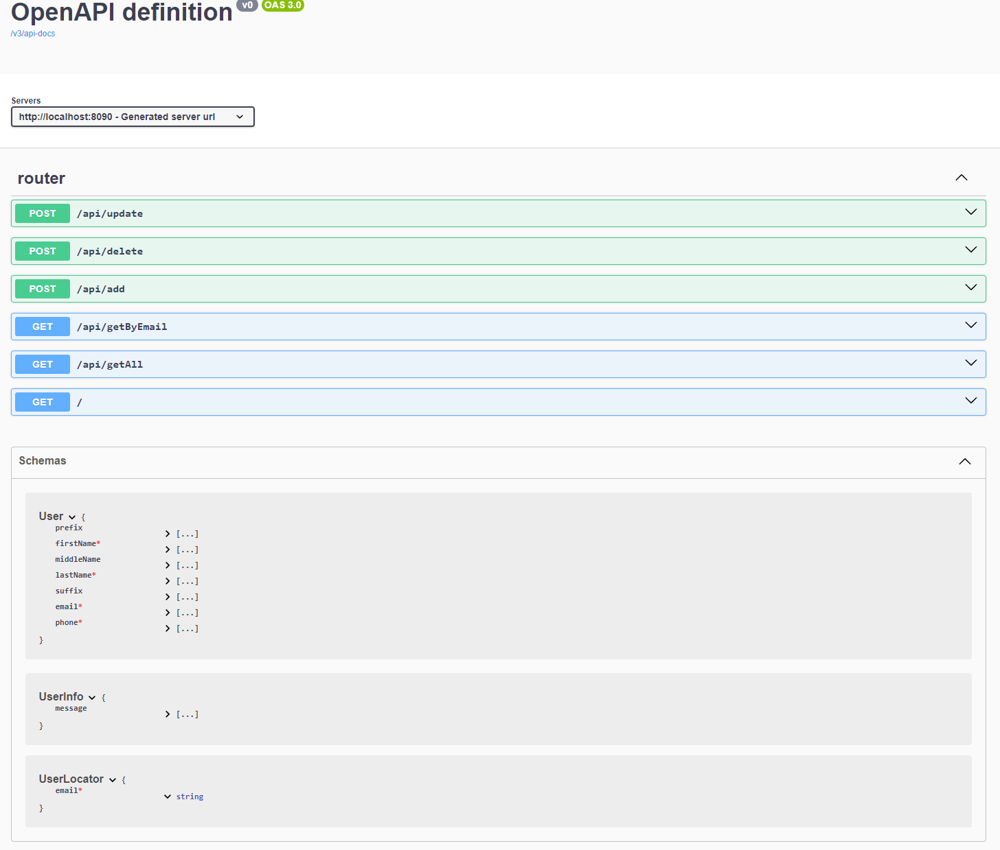

# Friday RESTful Service

The API service is a backend application to store user data (such as name, email and phone). 
The service has API endpoints to add, delete, update, query user data. The focus of this application is on how
to provide a full-stack development template for backend API that promotes: object-oriented architecture, testing,
 dynamic API documentation and cloud native deployment using docker.
The application also uses backend Database to store content, but this is not the main focus.

### Note
For a true cloud native, this application could be run from AWS lambda or GCP cloud function, and set the endpoints in API-Gateway. 
AWS API-gateway can hide the api behind authentication that can provide different permission for read and write calls. API-gateway can
also be configured with CDN cache and route-able url. The entire service and resources can be automated using terraform code. 

Instead, I choose to implement it as a single java standalone application, 
to make it testable in a single instance and to give more focus on the API calls alone.


# Code Overview
The Application is build in Java using the spring-boot framework. compiled with gradle and deployed using docker.

## Required
- [java 17](https://www.oracle.com/java/technologies/javase/jdk17-archive-downloads.html) or higher 
- gradle
- docker
- [docker-compose](https://github.com/docker/compose/releases/download/v2.29.2/docker-compose-linux-x86_64 )  

## Build
```
git clone https://github.com/biniamgebremichael/restful.git> 
cd restful> 
sh gradlew bootJar
```

## Run
```
./docker-compose  -f docker-compose.yaml  up
```
## Use

http://localhost:8090

## API Docs
http://localhost:8090/swagger-ui/index.html

